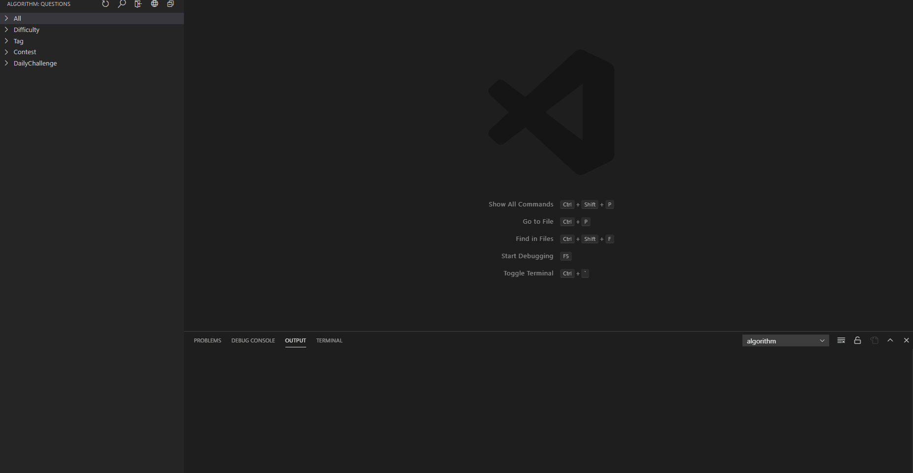
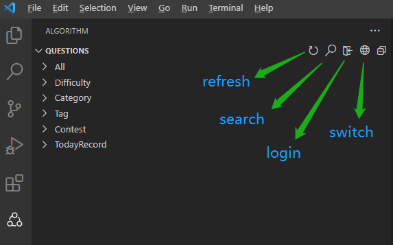
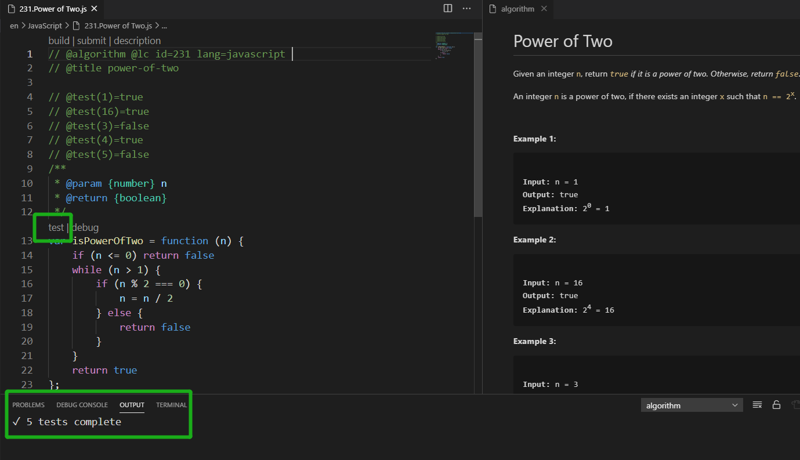
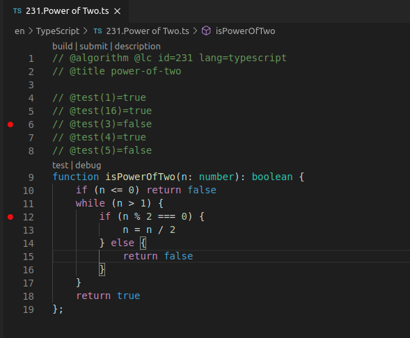
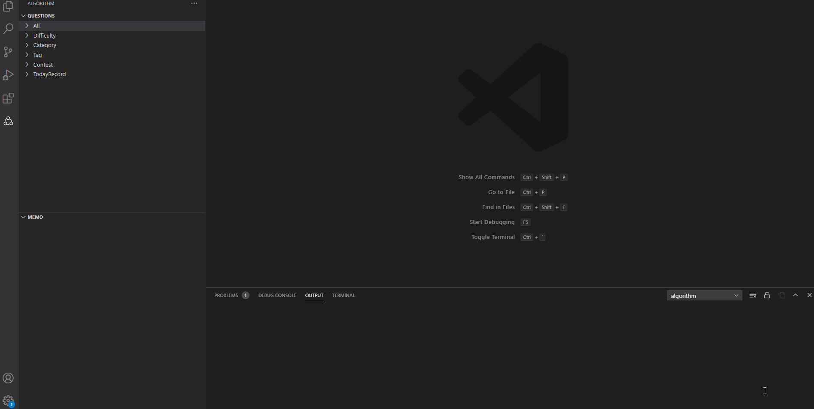
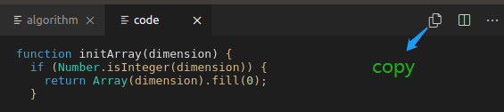

# algorithm

An excellent vscode extension for leetcode.

## Quick Start

## Support

- javascript
- typescript
- python3
- golang
- java

## Main Features

**将会很快支持其它语言**

- 代码里包含默认测试用例，也可以添加自定义的测试用例，点击测试按钮 自动在本地运行，支持链表和二叉树。

- debug 指定测试用例

- 备忘录

- 支持 import module, 打包代码， 快速复制打包的代码.(此功能仅支持 js/ts)

- 包含周赛 (正式比赛时直接使用 submit 是无效的,应该使用复制代码，然后在浏览器提交.)

## Other Features

- 搜索题目
- 每日一题
- 支持同时登录 https://leetcode.com/ 和 https://leetcode-cn.com/

## 运行条件

- javascript/typescript

  - Nodejs 12+

    > 默认会使用 node 执行测试和 debug，如果是使用 nvm 安装的，需要设置选项`algorithm.nodePath`

- python3

  - python3
  - 安装官方 Python 插件(https://code.visualstudio.com/docs/python/python-tutorial)

- golang

  - 确保 `go` 在环境变量里
  - 安装 golang 官方插件

- java
  - 确保`java`,`javac`在环境变量里，或者[设置 javaPath 和 javacPath](#Setting).
  - 安装 java 官方插件(https://code.visualstudio.com/docs/java/java-tutorial)

## 选择题目

在 `algorithm view` 选择题目

## 切换语言

按 `ctrl+shift+p` 选择 `algorithm:switch default language`，目前支持 javascript,typescript,python3

## 快捷按钮

> `view toolbar`有以下几种按钮

- fresh question
- search question
- login in
- switch endpoint
- collapse all

## 切换 leetcode 版本

### 目前支持:

- leetcode.com
- leetcode-cn.com

> Note: 账户不互通.

## 登录

登录方式参考了官方插件 [vscode-leetcode](https://github.com/LeetCode-OpenSource/vscode-leetcode).

- leetcode.com 支持 github 和 cookie.
- leetcode-cn.com 支持 账号密码,github 和 cookie.

## 运行测试

代码里包含默认测试用例，也可以自定义添加测试用例，点击测试按钮 自动在本地运行。

## Debug

只需要在一个测试用例前设置断点，然后给函数添加断点，点击 debug 按钮，便可以运行 debug。
支持 javascript,typescript,python3，golang,java。

:tada:

> Note: 如果你正在调试 java,确保已经打开的问题没有语法错误，否则将会编译失败，因为所有问题在同一个目录下，而 java 相关插件只支持一个目录一个项目。比如你打开了问题 1，但是没有补全代码，然后开始 debug 问题 2，这时候会报语法错误，因为问题 1 应该返回一个值。如果语法正确后编译仍然失败尝试按住 `ctrl+shift+p` ，然后执行命令 `Java:Clean Java Language Server Workspace`.

## 提交

点击 submit 提交代码.

## 备忘录

可以在备忘录里新建不同文件夹，例如 dfs,bfs 等，然后将题目添加进去

### **注意!**

正式比赛时直接使用 submit 是无效的,应该先点击 build，再点击 copy, 最后在浏览器提交.

### build code & copy code

- 点击 build

- 点击 copy

> 如果使用 js/ts 的话， 会自动导入包 [algm](https://github.com/supperchong/algm) ，包含了许多方便的函数和数据结构, 如 优先队列,线段树, 并查集 ,跳跃表等等. :rocket: 由于 treeshake , 打包后的代码不包含多余的代码.

## Setting

按 `ctrl+,` 或者打开 `file->Preferences->Settings`。
选择 `Extensions->algorithm`,将会看到:

| Setting Name    | Description                                      | Default Value |
| --------------- | ------------------------------------------------ | ------------- |
| Auto Import Str | 字符串的值将会插入到代码前面                     | ""            |
| Base Dir        | 题目保存目录                                     | $HOME/.alg    |
| Code Lang       | 使用的语言                                       | JavaScript    |
| Lang            | 使用指定的终端                                   | leetcode.com  |
| Node Path       | nodejs 可执行文件的路径. eg: /usr/local/bin/node | node          |
| javaPath        | java 可执行文件的路径.                           | java          |
| javacPath       | javac 可执行文件的路径.                          | javac         |

## 感谢

感谢官方插件[vscode-leetcode](https://github.com/LeetCode-OpenSource/vscode-leetcode), 本插件参考了登录方式和一些设计
